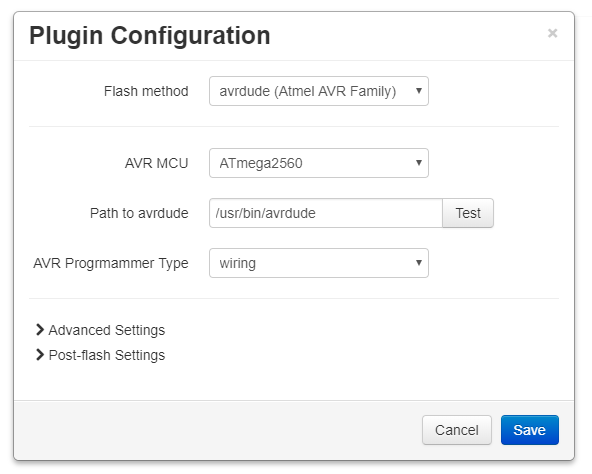

# ANYCUBIC PRUSA I3 XL

This repository adds custom configurations for the **Anycubic i3+** (also known as **Anycubic i3 XL** or **Anycubic i3 Ultrabase**) of the [Marlin Firmware](http://marlinfw.org/).

This printer is based on the Prusa i3 design and comes with a heat bed (the Anycubic Ultrabase) and an MK8 extruder, controlled by a RAMPS 1.3 board.

Please note that the **Anycubic i3 Mega** needs a different firmware (see [here](https://github.com/ANYCUBIC-3D/I3-MEGA)).

You can find the original fork (based on Marlin 1.1.0-pre8) in the *ANYCUBIC_PRUSA_I3_XL* folder. This version came most likely preinstalled on your printer.

## Version information

- Versions < 1.1.5 have the same configuration as the original firmware but lower temperature settings
- 1.1.5 enables manual bed leveling via menu option
- 1.1.6 also introduces baby stepping for z axis
- 1.1.9 uses S-Curve Acceleration and Continue after Power-Loss options

Precompiled firmwares (without bootloader) in hex format are in the corresponding sub folders. You could use the [OctoPrint FirmwareUpdater Plugin](https://github.com/OctoPrint/OctoPrint-FirmwareUpdater) to easily flash them.

Unsuitable modification may damage the machine, so please check the configuration before using these firmwares.

To copy them onto your printer, SSH into your Pi and run:

```bash
sudo apt-get update
sudo apt-get install avrdude
exit
```

Then use these settings:


